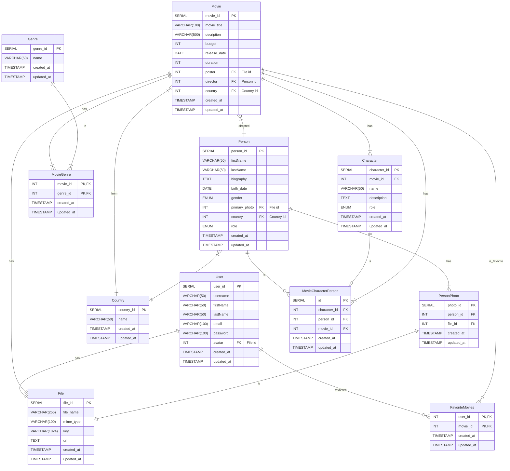

# Movie-App-Database-SQL-Structure

Homework for the DB &amp; SQL lecture in Binary Studio Academy

## ER-Diagram

```mermaid
  erDiagram
    User ||--|| File : has
    User {
        SERIAL user_id PK
        VARCHAR(50) username
        VARCHAR(50) firstName
        VARCHAR(50) lastName
        VARCHAR(100) email
        VARCHAR(100) password
        INT avatar FK "File id"
        TIMESTAMP created_at
        TIMESTAMP updated_at
    }
    File {
        SERIAL file_id PK
        VARCHAR(255) file_name
        VARCHAR(100) mime_type
        VARCHAR(1024) key
        TEXT url
        TIMESTAMP created_at
        TIMESTAMP updated_at
    }
    Movie ||--|| File : has
    Movie }|--|| Person : directed
    Movie }|--|| Country : from
    Movie {
        SERIAL movie_id PK
        VARCHAR(100) movie_title
        VARCHAR(500) decription
        INT budget
        DATE release_date
        INT duration
        INT poster FK "File id"
        INT director FK "Person id"
        INT country FK "Country id"
        TIMESTAMP created_at
        TIMESTAMP updated_at
    }
    Person }|--|| Country : from
    Person ||--|{ PersonPhoto : has
    Person {
        SERIAL person_id PK
        VARCHAR(50) firstName
        VARCHAR(50) lastName
        TEXT biography
        DATE birth_date
        ENUM gender
        INT primary_photo FK "File id"
        INT country FK "Country id"
        ENUM role
        TIMESTAMP created_at
        TIMESTAMP updated_at
    }
    Country {
        SERIAL country_id PK
        VARCHAR(50) name
        TIMESTAMP created_at
        TIMESTAMP updated_at
    }
    PersonPhoto ||--|| File : is
    PersonPhoto {
        SERIAL photo_id PK
        INT person_id FK
        INT file_id FK
        TIMESTAMP created_at
        TIMESTAMP updated_at
    }
    Movie ||--|{ MovieGenre : has
    MovieGenre {
        INT movie_id PK, FK
        INT genre_id PK, FK
        TIMESTAMP created_at
        TIMESTAMP updated_at
    }
    Genre ||--|{ MovieGenre : in
    Genre {
        SERIAL genre_id PK
        VARCHAR(50) name
        TIMESTAMP created_at
        TIMESTAMP updated_at
    }
    Movie ||--|{ Character : has
    Character {
        SERIAL character_id PK
        INT movie_id FK
        VARCHAR(50) name
        TEXT description
        ENUM role
        TIMESTAMP created_at
        TIMESTAMP updated_at
    }
    Person ||--o{ MovieCharacterPerson : is
    Character ||--o| MovieCharacterPerson : is
    Movie ||--|{ MovieCharacterPerson : has
    MovieCharacterPerson {
        SERIAL id PK
        INT character_id FK
        INT person_id FK
        INT movie_id FK
        TIMESTAMP created_at
        TIMESTAMP updated_at
    }
    User ||--o{ FavoriteMovies : favorites
    Movie ||--o{ FavoriteMovies : is_favorite
    FavoriteMovies {
        INT user_id PK, FK
        INT movie_id PK, FK
        TIMESTAMP created_at
        TIMESTAMP updated_at
    }
```
